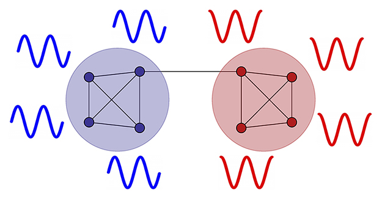

Time Series Clustering via Community Detection in Networks
======================
Leonardo N. Ferreira and Liang Zhao



In this page you find the code used in the paper.  
DOI: [doi.org/10.1016/j.ins.2015.07.046](http://doi.org/10.1016/j.ins.2015.07.046)  
arXiv: [arxiv.org/abs/1508.04757](http://arxiv.org/abs/1508.04757)

### Code

All the algorithms and experiments used in this paper were implemented using [R](https://www.r-project.org/). [Download](https://github.com/lnferreira/time_series_clustering_via_community_detection/zipball/gh-pages) the code and open the R folder. There are 3 files:

* R/
   * tsClustAlgs.R
      - Clustering algorithms
   * tsDist.R 
      - Calculates distance between a set of time series
   * run.R
      - Example of how to use the code
      
### Bibtex

If you used this code, please cite our paper.

```
@article{ferreira16,
  title = "Time series clustering via community detection in networks",
  journal = "Information Sciences",
  volume = "326",
  pages = "227 - 242",
  year = "2016",
  issn = "0020-0255",
  doi = "https://doi.org/10.1016/j.ins.2015.07.046",
  url = "http://www.sciencedirect.com/science/article/pii/S002002551500554X",
  author = "Leonardo N. Ferreira and Liang Zhao",
  keywords = "Time series data mining, Time series clustering, Complex networks, Community detection"
}
```

### Contact

If you have questions or sugestions, send us an email:

**Leonardo N. Ferreira**<br>
[ferreira@leonardonascimento.com](ferreira@leonardonascimento.com)<br>
[www.leonardonascimento.com](www.leonardonascimento.com)

**Zhao Liang**<br>
[zhao@usp.br](zhao@usp.br)<br>
[dcm.ffclrp.usp.br/~zhao/](dcm.ffclrp.usp.br/~zhao/)
